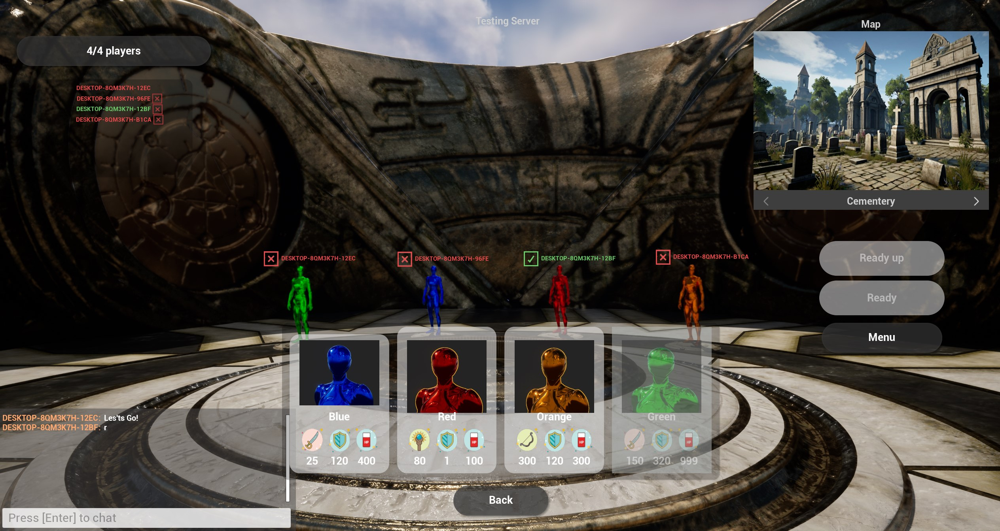

# Just Another Lobby

This is a proof of concept in which a multiplayer game for up to four players was created to apply both basic and advanced concepts handled by Unreal Engine.

The project is developed in C++ and Blueprints in Unreal Engine version 5.1. Additionally, plugins such as `CommonUI` and `AdvancedSteamSessions` were utilized.

If you want to have a better experience, run the game in standalone so that the loading screen works correctly.

## Features

- Fully Replicated
- Integration with Advanced Steam Session/LAN
- Host Games
- Find Games
- Options Settings
- Hero Selection Spot (Max 4 Players)
- Ready Player Status
- Kick Player from Lobby
- Chat System
- Loading Screen (MoviePlayer it only works in standalone mode)

 

Download [Demo](https://multiplayergame.blob.core.windows.net/justanotherlobby/JustAnotherLobby.rar).

Read more about [Replication](https://unrealcommunity.wiki/replication-vyrv8r37).