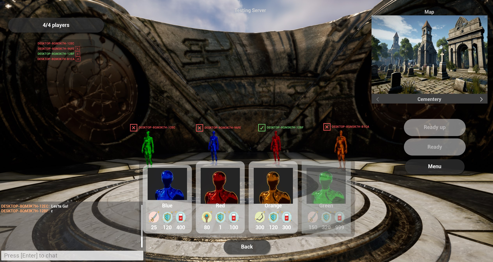

# Just Another Lobby

This is a proof of concept in which a multiplayer game for up to four players was created to apply both basic and advanced concepts handled by Unreal Engine.

The project is developed in C++ and Blueprints in Unreal Engine version 5.7. Additionally, plugins such as `CommonUI` and `AdvancedSteamSessions` were utilized.

If you want to have a better experience, run the game in standalone so that the loading screen works correctly.

## Give a Star! ⭐
If you liked the project or if JustAnotherLobby helped you, please give a star ;)

## Build Requirements

### Prerequisites
- **Unreal Engine 5.7**
- **Visual Studio 2022** (Community, Professional, or Enterprise)
- **MSVC C++ Toolchain 14.38.x** (recommended for Unreal Engine 5.7 compatibility)

### Setting Up the Correct Compiler Toolchain

Unreal Engine 5.7 works best with the **MSVC 14.38 toolchain**. If you have multiple compiler versions installed or encounter compilation errors related to preprocessor macros, follow these steps:

#### 1. Install MSVC 14.38 Toolchain

1. Open **Visual Studio Installer**
2. Click **Modify** on your Visual Studio 2022 installation
3. Go to the **Individual Components** tab
4. Search for: `MSVC v143 - VS 2022 C++ x64/x86 build tools (v14.38-17.8)`
5. Check the box to install it
6. Click **Modify** and wait for the installation to complete

#### 2. Verify Your Current Compiler Version

To check which compiler version you're currently using:

```powershell
# Open Developer Command Prompt for VS 2022, then run:
cl
```

You should see output similar to:
```
Microsoft (R) C/C++ Optimizing Compiler Version 19.38.xxxxx for x64
```

The version `19.38.xxxxx` corresponds to MSVC toolchain `14.38.xxxxx`.

#### 3. Force Specific Compiler Version (Optional)

If you have multiple compiler versions installed and need to force Unreal Build Tool to use 14.38:

1. Create a file named `BuildConfiguration.xml` in one of these locations:
   - `[ProjectRoot]/Source/BuildConfiguration.xml` (project-specific)
   - `%APPDATA%/Unreal Engine/UnrealBuildTool/BuildConfiguration.xml` (global)

2. Add the following content:

```xml
<?xml version="1.0" encoding="utf-8" ?>
<Configuration xmlns="https://www.unrealengine.com/BuildConfiguration">
    <WindowsPlatform>
        <CompilerVersion>14.38</CompilerVersion>
    </WindowsPlatform>
    <BuildConfiguration>
        <bAllowXGE>false</bAllowXGE>
        <bAllowFASTBuild>false</bAllowFASTBuild>
    </BuildConfiguration>
</Configuration>
```

> **Note:** The `BuildConfiguration.xml` file is **not included** in this repository to maintain portability. Only create this file if you experience compiler-related issues.

### Building the Project

1. Close Unreal Editor if it's running
2. Right-click on `JustAnotherLobby.uproject` → **Generate Visual Studio project files**
3. Open `JustAnotherLobby.sln` in Visual Studio 2022
4. Set build configuration to **Development Editor**
5. Build the solution (Ctrl+Shift+B)

### Troubleshooting

#### "Live Coding is Active" Error
- Close the Unreal Editor completely
- Rebuild from Visual Studio

#### Template/Preprocessor Errors (C4668, C2039)
- Ensure you're using MSVC 14.38.x toolchain
- Create a `BuildConfiguration.xml` file as described above
- Clean the solution and regenerate project files:
  ```
  - Delete: Binaries, Intermediate, Saved folders
  - Delete: .sln, .vs folders
  - Right-click .uproject → Generate Visual Studio project files
  ```

#### Compiler Version Mismatch
- If you see errors about `__has_feature` or similar preprocessor macros, you likely have a newer compiler (14.40+) that's incompatible
- Install MSVC 14.38 toolchain and create the `BuildConfiguration.xml` file

## Features

- Fully Replicated
- Integration with Advanced Steam Session/LAN
- Host Games
- Find Games
- Options Settings
- Hero Selection Spot (Max 4 Players)
- Ready Player Status
- Kick Player from Lobby
- Chat System
- Loading Screen (MoviePlayer it only works in standalone mode)

 

Download [Demo](https://multiplayergame.blob.core.windows.net/justanotherlobby/JustAnotherLobby.rar).

Read more about [Replication](https://unrealcommunity.wiki/replication-vyrv8r37).